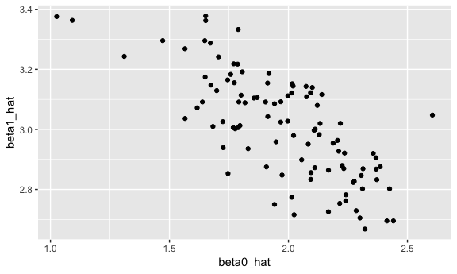

Simulation
================

Simulation
----------

Simulation function

``` r
sim_regression = function(n, beta0 = 2, beta1 = 3) {
  
  sim_data = tibble(
    x = rnorm(n, mean = 1, sd = 1),
    y = beta0 + beta1 * x + rnorm(n, 0, 1)
  )
  
  ls_fit = lm(y ~ x, data = sim_data)
  
  tibble(
    beta0_hat = coef(ls_fit)[1],
    beta1_hat = coef(ls_fit)[2]
  )
}
```

Run it a few times.

``` r
sim_regression(n = 30, beta0 = 2, beta1 = 3)
## # A tibble: 1 x 2
##   beta0_hat beta1_hat
##       <dbl>     <dbl>
## 1      2.09      3.04
```

Iterate simulations!!

``` r
output = vector("list", length = 100)

for (i in 1:100) {
  output[[i]] = sim_regression(n = 30, beta0 = 2, beta1 = 3)
}

#output---100 lists
results = 
  output %>% 
  bind_rows()
```

``` r
results %>% 
  summarize(mean_b0 = mean(beta0_hat),
            mean_b1 = mean(beta1_hat))
## # A tibble: 1 x 2
##   mean_b0 mean_b1
##     <dbl>   <dbl>
## 1    1.98    3.01

results %>% 
  ggplot(aes(x = beta0_hat, y = beta1_hat)) + 
  geom_point()
```



A better way to iterate ...when no input list

``` r
?rerun
results = 
  rerun(1000, sim_regression(30, 2, 3)) %>% 
  bind_rows()
```

``` r
results %>% 
  gather(key = parameter, value = estimate, beta0_hat:beta1_hat) %>% 
  group_by(parameter) %>% 
  summarize(emp_mean = mean(estimate),
            emp_var = var(estimate)) %>% 
  knitr::kable(digits = 3)
```

| parameter  |  emp\_mean|  emp\_var|
|:-----------|----------:|---------:|
| beta0\_hat |      1.998|     0.076|
| beta1\_hat |      2.994|     0.041|

Increase sample size
--------------------

``` r
n_list = list("n_30"  = 30, 
              "n_60"  = 60, 
              "n_120" = 120, 
              "n_240" = 240)
output = vector("list", length = 4)

for (i in 1:4) {
  output[[i]] = 
    rerun(100, sim_regression(n = n_list[[i]], 2, 3)) %>% 
    bind_rows
}
```

Recast using `map`s ... n = sample size = number of observations n\_runs = times of runs

``` r
simulate_n_regressions = function(n_runs = 100, n, beta0 = 2, beta1 = 3) {
  
  rerun(n_runs, sim_regression(n, beta0, beta1)) %>% 
    bind_rows()
  
}
simulate_n_regressions(100, 30, 2, 3)
## # A tibble: 100 x 2
##    beta0_hat beta1_hat
##        <dbl>     <dbl>
##  1      2.53      2.61
##  2      2.56      2.75
##  3      1.84      3.05
##  4      2.00      2.93
##  5      1.72      3.11
##  6      1.85      3.13
##  7      1.93      3.13
##  8      2.35      2.66
##  9      2.10      2.77
## 10      1.93      3.13
## # ... with 90 more rows
simulate_n_regressions(n = 30)
## # A tibble: 100 x 2
##    beta0_hat beta1_hat
##        <dbl>     <dbl>
##  1      2.10      2.96
##  2      2.18      2.97
##  3      2.09      2.85
##  4      2.23      2.86
##  5      1.77      3.06
##  6      2.42      2.73
##  7      1.42      3.42
##  8      1.86      3.06
##  9      1.59      3.40
## 10      1.78      3.24
## # ... with 90 more rows
simulate_n_regressions(150, 30, 20, -30)
## # A tibble: 150 x 2
##    beta0_hat beta1_hat
##        <dbl>     <dbl>
##  1      19.7     -29.7
##  2      20.0     -30.1
##  3      20.3     -29.9
##  4      20.1     -30.0
##  5      19.6     -29.9
##  6      20.0     -29.8
##  7      19.7     -29.8
##  8      19.8     -30.1
##  9      19.9     -29.7
## 10      20.0     -30.0
## # ... with 140 more rows
```

``` r
map(n_list, ~simulate_n_regressions(n_runs = 100, n = .x, beta0 = 2, beta1 = 3))
## $n_30
## # A tibble: 100 x 2
##    beta0_hat beta1_hat
##        <dbl>     <dbl>
##  1      1.59      3.18
##  2      1.97      2.92
##  3      2.22      2.84
##  4      1.98      2.94
##  5      2.00      3.06
##  6      2.15      3.00
##  7      2.06      2.74
##  8      2.16      2.87
##  9      2.34      2.96
## 10      1.79      3.09
## # ... with 90 more rows
## 
## $n_60
## # A tibble: 100 x 2
##    beta0_hat beta1_hat
##        <dbl>     <dbl>
##  1      1.76      3.27
##  2      1.98      3.05
##  3      1.85      3.19
##  4      2.03      2.90
##  5      1.64      3.15
##  6      2.00      2.95
##  7      1.70      3.10
##  8      1.95      2.99
##  9      2.11      2.97
## 10      2.41      2.78
## # ... with 90 more rows
## 
## $n_120
## # A tibble: 100 x 2
##    beta0_hat beta1_hat
##        <dbl>     <dbl>
##  1      1.94      3.04
##  2      1.93      3.04
##  3      2.01      2.99
##  4      1.93      3.02
##  5      1.90      3.06
##  6      2.03      3.19
##  7      1.83      2.99
##  8      1.83      3.01
##  9      1.96      3.00
## 10      2.12      2.98
## # ... with 90 more rows
## 
## $n_240
## # A tibble: 100 x 2
##    beta0_hat beta1_hat
##        <dbl>     <dbl>
##  1      2.00      2.95
##  2      1.87      3.12
##  3      1.89      3.03
##  4      2.15      2.93
##  5      1.83      3.10
##  6      2.15      2.96
##  7      1.86      3.02
##  8      2.00      2.97
##  9      1.89      3.05
## 10      1.95      3.07
## # ... with 90 more rows
```

Use a list column

``` r
sim_results = 
  tibble(sample_size = c(30, 60, 120, 240)) %>% 
  mutate(estimate_dfs = map(.x = sample_size, ~simulate_n_regressions(n_runs = 1000, n = .x))) %>% 
  unnest
```

sample size increase, var decreases.

``` r
sim_results %>% 
  group_by(sample_size) %>% 
  summarize(emp_var_b1 = var(beta1_hat))
## # A tibble: 4 x 2
##   sample_size emp_var_b1
##         <dbl>      <dbl>
## 1          30    0.0360 
## 2          60    0.0182 
## 3         120    0.00853
## 4         240    0.00412
```

plots

``` r
sim_results %>% 
  ggplot(aes(x = beta0_hat, y = beta1_hat)) + 
  geom_point() +
  facet_grid(~sample_size)
```


``` r
sim_results %>% 
  mutate(
    sample_size = str_c("n = ", sample_size),
    sample_size = fct_inorder(sample_size)) %>% 
  ggplot(aes(x = sample_size, y = beta1_hat, fill = sample_size)) + 
  geom_violin()
```

 the width of the distribution shrinks as sample size grows

``` r
sim_results %>% 
  mutate(
    sample_size = str_c("n = ", sample_size),
    sample_size = fct_inorder(sample_size)) %>% 
  ggplot(aes(x = beta0_hat, y = beta1_hat)) + 
  geom_point(alpha = .2) + 
  facet_grid(~sample_size)
```


``` r
sim_results %>% 
  gather(key = parameter, value = estimate, beta0_hat:beta1_hat) %>% 
  group_by(parameter, sample_size) %>% 
  summarize(emp_mean = mean(estimate),
            emp_var = var(estimate)) %>% 
  knitr::kable(digits = 3)
```

| parameter  |  sample\_size|  emp\_mean|  emp\_var|
|:-----------|-------------:|----------:|---------:|
| beta0\_hat |            30|      2.020|     0.071|
| beta0\_hat |            60|      1.997|     0.036|
| beta0\_hat |           120|      1.999|     0.016|
| beta0\_hat |           240|      1.999|     0.009|
| beta1\_hat |            30|      2.985|     0.036|
| beta1\_hat |            60|      3.000|     0.018|
| beta1\_hat |           120|      2.999|     0.009|
| beta1\_hat |           240|      3.002|     0.004|

Publication bias
----------------

New `sim_regression` function.

``` r
sim_regression = function(n_samp = 30, beta0 = 2, beta1 = 3) {
  
  sim_data = tibble(
    x = rnorm(n_samp),
    y = beta0 + beta1 * x + rnorm(n_samp, 0, sqrt(50))
  )
  ls_fit = lm(y ~ x, data = sim_data)
  broom::tidy(ls_fit) 
}
```

Simulate for various SLOPE values. This code chunk takes a while to run, but it's good to have 10000 iterations -- later, when we average over significant results, we end up with a much smaller number of iterations when power is low.

``` r
sim_results = 
  tibble(beta1_true = 0:6) %>% 
  mutate(
    estimate_dfs = map(.x = beta1_true, ~simulate_n_regressions(n_runs = 10000, n = 30, beta1 = .x))
  )  
```

Tidy up results.

``` r
sim_results = 
  sim_results %>% 
  unnest() %>% 
  filter(term == "x") %>% 
  select(beta1_true, estimate, p.value) %>% 
  mutate(significant = as.numeric(p.value < 0.05))
```

``` r
sim_results %>% 
  group_by(beta1_true) %>% 
  summarize(mean_est = mean(estimate),
            power = mean(significant))
## # A tibble: 7 x 3
##   beta1_true mean_est  power
##        <int>    <dbl>  <dbl>
## 1          0 -0.00582 0.0499
## 2          1  0.998   0.118 
## 3          2  2.01    0.310 
## 4          3  3.00    0.587 
## 5          4  4.00    0.815 
## 6          5  5.00    0.933 
## 7          6  6.00    0.983
```

Look at the real thing of interest

``` r
results_summary = 
  sim_results %>% 
  group_by(beta1_true) %>%
  nest() %>% 
  mutate(
    all = map_dbl(.x = data, ~ .x %>% pull(estimate) %>% mean),
    signif = map_dbl(.x = data, ~ .x %>% filter(significant == 1) %>% pull(estimate) %>% mean)
  ) %>% 
  select(-data) %>% 
  gather(key = results, value = average, all:signif) 
results_summary %>% 
  ggplot(aes(x = beta1_true, y = average, color = results)) + 
  geom_point() +
  geom_path() 
```


``` r
sim_results %>% 
  ggplot(aes(x = estimate)) + geom_histogram() + 
  facet_grid(significant ~ beta1_true)
## `stat_bin()` using `bins = 30`. Pick better value with `binwidth`.
```


